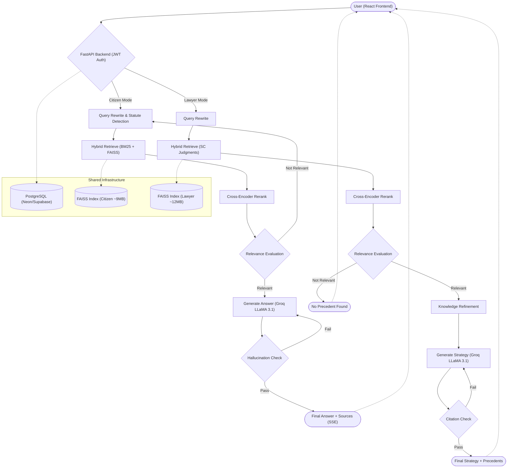

# ⚖️ NyayaMitra — AI Legal Platform

**NyayaMitra** ("Friend of Justice") is a full-stack AI-powered legal information platform for the Indian legal system. Built as a final-year academic and placement portfolio project.


---

## 🧠 What It Does

NyayaMitra has two modules serving different user types:

### 👤 Citizen Legal Assistant
Answers everyday legal questions in plain language using a **Self-RAG + Corrective-RAG pipeline** over a corpus of Indian statutes (IPC, CrPC, RTI Act, Consumer Protection Act, Constitution of India). Key features:
- Hybrid BM25 + FAISS retrieval with cross-encoder reranking
- Hallucination detection with source grounding
- Conversational context — follow-up questions resolve correctly against prior answers
- Legal document drafting (FIR, consumer complaint, RTI application)

### ⚖️ Lawyer Research Tool
Helps lawyers find similar case judgments and generate structured litigation documents:
- Case similarity search over ~150 uploaded judgment PDFs
- Litigation strategy generator with cited precedents
- Auto-generation of bail applications, legal notices, written arguments
- Citation verification — fabricated case names are detected and stripped before output

---

## 🏗️ System Architecture



---

## 🛠 Tech Stack

| Layer | Technology |
|-------|-----------|
| Backend API | FastAPI, Python 3.10 |
| AI Pipeline | LangGraph (Self-RAG), LangChain |
| LLM | Groq Cloud — LLaMA 3.1 8B Instant |
| Retrieval | FAISS + BM25 hybrid, `ms-marco-MiniLM-L6-v2` cross-encoder reranker |
| Embeddings | `all-MiniLM-L6-v2` (sentence-transformers) |
| Database | PostgreSQL (SQLAlchemy) |
| Auth | JWT (python-jose) |
| Frontend | React 18, Vite, TailwindCSS |

---

## 📂 Project Structure

```
NyayaMitra/
├── backend/
│   ├── app/
│   │   ├── api/endpoints/      # FastAPI route handlers
│   │   ├── core/               # JWT auth
│   │   ├── db/                 # SQLAlchemy models + session
│   │   ├── schemas/            # Pydantic request/response models
│   │   └── services/
│   │       ├── citizen_graph.py    # LangGraph Self-RAG pipeline (citizen)
│   │       ├── lawyer_graph.py     # LangGraph pipeline (lawyer)
│   │       ├── vector_service.py   # FAISS retrieval + document generation
│   │       ├── retrieval/          # HybridRetriever, CrossEncoderReranker
│   │       └── prompts/            # Prompt registry (versioned templates)
│   ├── data/
│   │   ├── judgments_index/    # FAISS index for lawyer case search (~12MB)
│   │   ├── vectors/citizen/    # FAISS index for citizen RAG (~9MB)
│   │   └── pdfs/               # ~150 Indian court judgment PDFs (~24MB)
│   ├── scripts/
│   │   ├── sanity_check.py     # Pre-demo health check
│   │   ├── run_eval.py         # RAG evaluation (RAGAS)
│   │   ├── add_arrest_rights_chunks.py  # Data prep — index augmentation
│   │   └── quarantine_empty_pdfs.py     # Data prep — corpus cleaning
│   ├── Dockerfile              # HF Spaces Docker SDK config
│   ├── requirements.txt        # Production dependencies
│   └── requirements-dev.txt    # Eval-only deps (ragas, datasets)
└── frontend/
    ├── src/
    │   ├── pages/              # LandingPage, Login, Register, ChatPage,
    │   │                       # CitizenDashboard, LawyerDashboard
    │   ├── components/         # SimilaritySearch, DocumentGenerator, etc.
    │   └── utils/auth.js       # Token management + API base URL
    └── .env.example            # Documents VITE_API_URL for Vercel
```

---

## ⚙️ Local Development Setup

### Prerequisites
- Python 3.10+
- Node.js 18+
- PostgreSQL (local) 
- [Groq API key](https://console.groq.com) (free tier)

### Backend

```bash
cd backend
python -m venv venv
# Windows:  venv\Scripts\activate
# macOS/Linux: source venv/bin/activate

pip install -r requirements.txt

# Copy and fill in the required variables
cp .env.example .env
# Edit .env: set DATABASE_URL, GROQ_API_KEY, SECRET_KEY

uvicorn app.main:app --reload
# → http://localhost:8000
# → http://localhost:8000/docs  (Swagger UI)
```

### Frontend

```bash
cd frontend
npm install

# Copy and fill in the backend URL
cp .env.example .env.local
# Edit .env.local: VITE_API_URL=http://localhost:8000  (for local dev)

npm run dev
# → http://localhost:5173
```

---

## 🚀 Deployment Status

This project is not currently deployed to a public URL. The frontend is ready to deploy to Vercel (see `.env.example` for the required `VITE_API_URL` variable).

The backend was tested against Render's free tier during development — it builds successfully but the ML pipeline (`sentence-transformers` embeddings, cross-encoder reranker, FAISS) exceeds the free tier's 512MB RAM limit at model-load time, causing an out-of-memory crash. Free tiers with sufficient RAM for this stack (e.g., Hugging Face Spaces Docker CPU tier) require billing verification that wasn't available for this project.

A `Dockerfile` is included and ready for deployment on any host with adequate RAM (4GB+ recommended). For demonstration purposes, run both frontend and backend locally per the setup instructions above.

### Database — Neon (free tier)
1. Create a project at [neon.tech](https://neon.tech).
2. Copy the connection string and set it as `DATABASE_URL` locally or on your host.
3. Tables are created automatically on first backend startup.

---

## 📌 Academic Context

This project was developed as a final-year B.Tech project exploring applied LLM systems for domain-specific retrieval. It is **not legal advice** — it is an academic demonstration of RAG system design over Indian legal corpora.

---

*⚖️ NyayaMitra — Democratizing access to legal information through AI.*
